# StudyMate AI

**An intelligent AI learning workspace powered by LangGraph, RAG, real-time web search, and multi-provider LLM orchestration.**

StudyMate AI brings general learning support, exam revision, interactive quizzes, assignment guidance, document understanding, current-information research, and CV/LinkedIn preparation into one focused workspace. It combines specialized AI workflows with persistent conversations, streamed responses, and grounded retrieval rather than treating every request as a standalone chat prompt.

[](https://nextjs.org/)
[](https://www.typescriptlang.org/)
[](https://www.langchain.com/langgraph)
[](https://www.postgresql.org/)
[](https://vercel.com/)

**Live application:** [studymateai.app](https://studymateai.app)

## Product overview

Students often have to move between a general chatbot, revision tools, quiz apps, document readers, search engines, and career-writing tools. StudyMate AI provides those capabilities in a single conversation-first product while preserving the context of what the user is studying.

Behind the interface, a LangGraph router selects a specialized workflow using deterministic rules and AI-assisted intent classification. A response can draw from conversation history, checkpointed workflow state, uploaded PDFs, semantic retrieval, or live web evidence - depending on what the request actually needs.

## Core features

| Capability | What it provides |
| --- | --- |
| **Intelligent AI chat** | Context-aware explanations, study support, writing help, research, and general questions with real token streaming. |
| **LangGraph orchestration** | Intent-based routing across direct, document, web, planner, revision, quiz, and assignment workflows. |
| **Exam Revision** | Focused summaries, priorities, definitions, common mistakes, memory support, and exam-oriented practice. |
| **Interactive quizzes** | Structured multiple-choice quizzes with selectable answers, submission, scoring, explanations, retry, and persisted progress. |
| **Assignment Help** | Requirement and rubric breakdowns, suggested structure, writing feedback, and step-by-step guidance. |
| **CV / LinkedIn assistance** | Practical CV, LinkedIn, cover-letter, ATS keyword, interview, and career-planning support through Career mode. |
| **PDF document intelligence** | Page-aware extraction, semantic RAG, document-grounded answers, and filename/page references. |
| **Real-time web search** | Tavily-backed search for current information, evidence verification, and clickable source links. |
| **Persistent conversations** | PostgreSQL-backed chats, messages, attachments, documents, quiz state, and LangGraph checkpoints. |
| **Multi-provider AI** | Groq, Google Gemini, and OpenRouter with role-aware fallback and failure handling. |
| **Authentication and accounts** | Google OAuth, email/password authentication, email verification, password recovery, preferences, data export, and deletion controls. |
| **Responsive interface** | Desktop and mobile chat layouts, collapsible navigation, Markdown/code rendering, and light/dark/system themes. |

## Product walkthrough

### Intelligent AI workspace

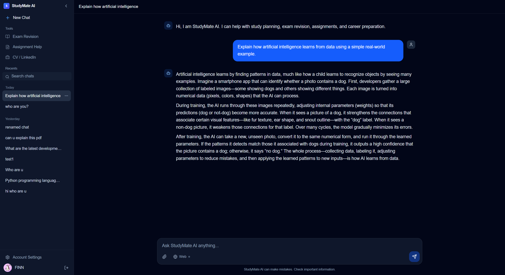

### Study and assessment workflows

| Exam Revision | Interactive Quiz |
| --- | --- |
| 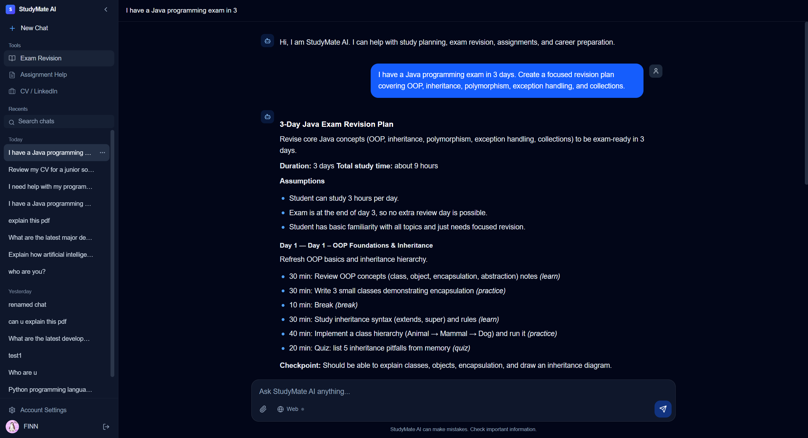 | 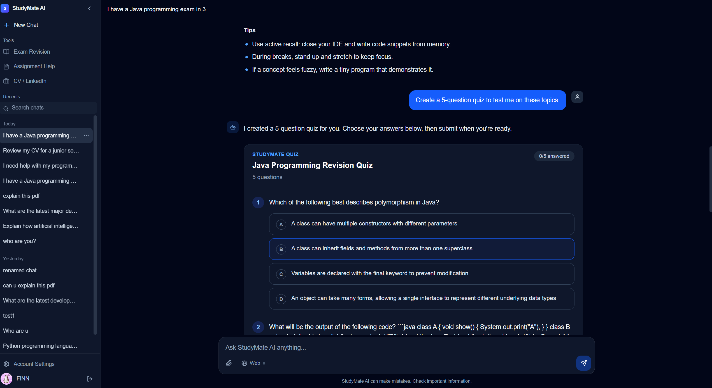 |

### Grounded research

| PDF RAG | Web Search |
| --- | --- |
| 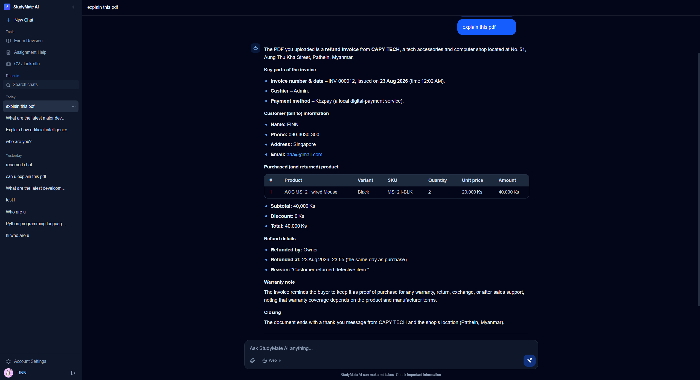 | 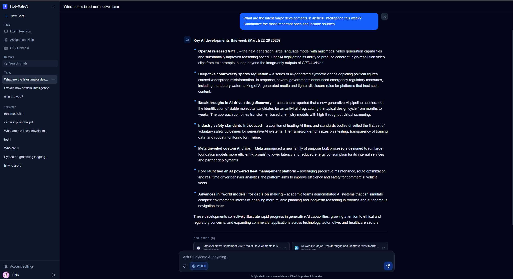 |

### Guided modes

| Assignment Help | Career Mode |
| --- | --- |
| 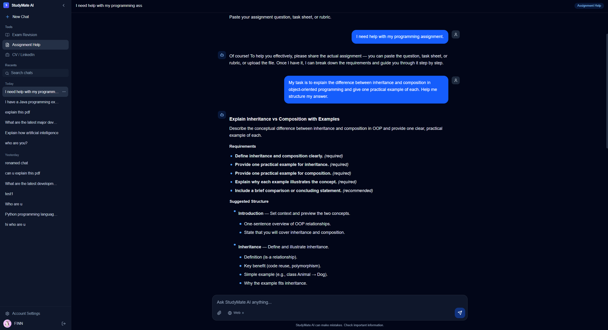 | 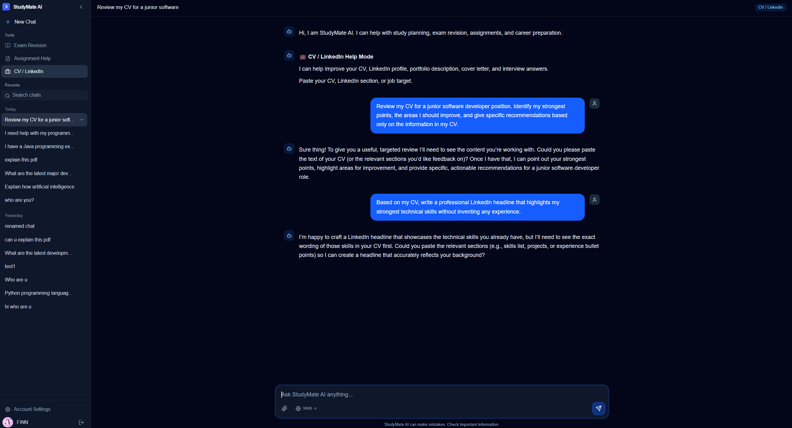 |

<details>
<summary><strong>Authentication and conversation management</strong></summary>

| Login | Sign up |
| --- | --- |
| 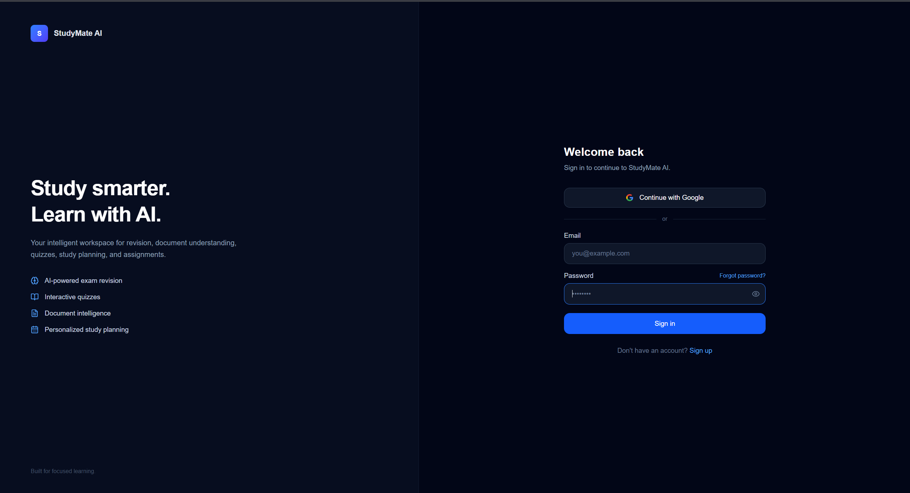 | 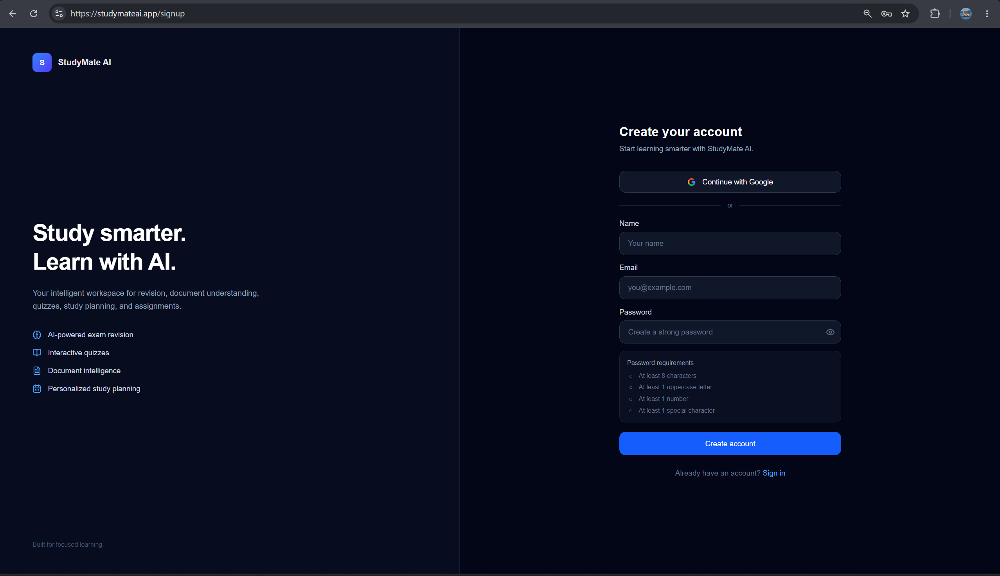 |

| Rename chat | Delete chat |
| --- | --- |
| 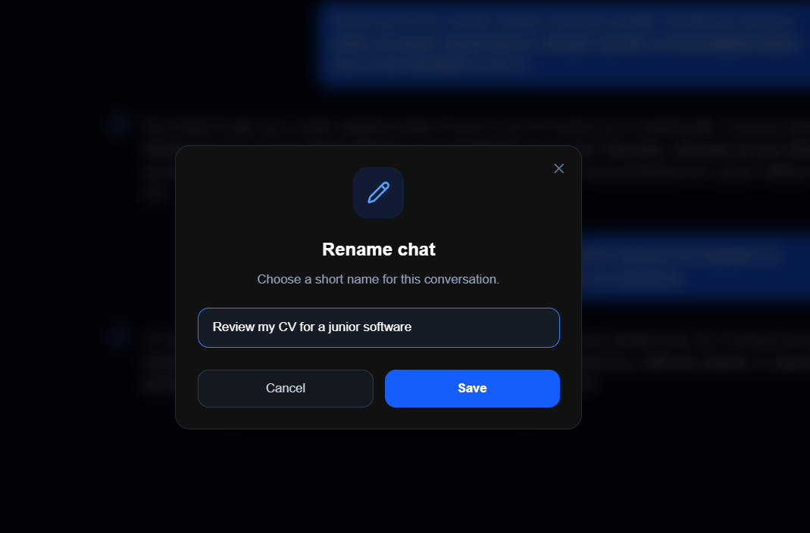 |  |

</details>

## How it works

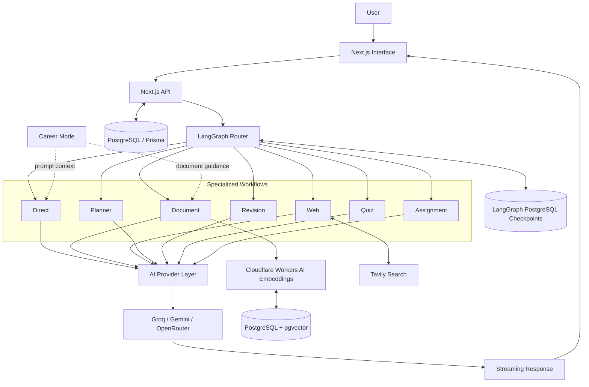

Career support is a mode applied to the appropriate response and document workflows; it is not a separate LangGraph route.

## LangGraph workflow routing

StudyMate uses high-confidence deterministic rules for clear requests and AI-assisted intent routing for ambiguous ones. The router also considers recent conversation history, the previous workflow, uploaded-document state, and whether web search is enabled.

| Route | Responsibility |
| --- | --- |
| `direct` | Stable general knowledge, explanations, and normal conversational requests. |
| `document` | Semantic retrieval and answers grounded in uploaded PDFs. |
| `web` | Current-information requests backed by Tavily evidence and source links. |
| `planner` | Structured study plans and contextual plan modifications. |
| `revision` | Exam-focused revision material and follow-up refinements. |
| `quiz` | Structured interactive quiz generation and quiz follow-ups. |
| `assignment` | Assignment requirements, rubrics, structure, feedback, and guidance. |

Checkpointed state enables contextual handoffs between workflows. For example, a learner can generate Java revision material and then ask for "a quiz on these topics"; the quiz workflow resolves the subject from the preceding revision turn rather than treating the request as a new generic topic.

## Document RAG pipeline

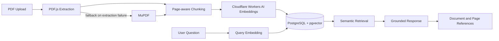

PDF text is split into overlapping chunks without losing its original page number. StudyMate generates 1,024-dimensional embeddings with Cloudflare Workers AI, stores them in pgvector, and retrieves the most relevant chunks within the current chat before generating an answer.

PDF.js is the primary text extractor and MuPDF provides a fallback for PDFs that PDF.js cannot parse reliably. Image-only PDFs are reported as unsupported because the application does not perform OCR.

## Multi-provider AI

StudyMate integrates three LLM providers:

- **Groq** for low-latency generation and structured workflows
- **Google Gemini** as part of the cross-provider reliability chain
- **OpenRouter** for additional model availability and fallback

Requests are assigned an appropriate model role based on the workload. The provider layer skips unavailable configurations, handles retryable provider failures, and advances through the relevant fallback chain. Normal text responses stream provider deltas through LangGraph and the Next.js API to the browser in real time.

## Technology stack

| Area | Technologies |
| --- | --- |
| **Frontend** | Next.js 16, React 19, TypeScript, Tailwind CSS 4, React Markdown, Remark GFM, React Syntax Highlighter, Lucide React |
| **AI & orchestration** | LangGraph, LangChain Core, Zod structured validation, Groq, Google Gemini, OpenRouter |
| **Data & RAG** | PostgreSQL, Prisma 7, pgvector, Cloudflare Workers AI embeddings, PDF.js, MuPDF |
| **Authentication** | Auth.js / NextAuth, Google OAuth, credentials authentication, bcryptjs |
| **External services** | Tavily web search, Resend transactional email |
| **Deployment** | Vercel, managed PostgreSQL, external AI/search/email services |

## Project structure

```text
studymate-ai/
|-- app/                  # App Router pages and API endpoints
|-- components/           # Authentication and chat UI components
|-- lib/
|   |-- ai/               # Providers, agents, prompts, tools, and LangGraph
|   `-- rag/              # PDF extraction, embeddings, ingestion, and retrieval
|-- prisma/               # Prisma schema and PostgreSQL/pgvector migrations
|-- scripts/              # Setup, workflow, provider, RAG, and integration utilities
|-- tests/                # Test fixtures
|-- types/                # Shared chat and quiz types
|-- auth.ts               # Auth.js configuration
|-- prisma.config.ts      # Prisma migration configuration
`-- proxy.ts              # Authenticated route protection
```

## Local development

### Prerequisites

- Node.js compatible with Next.js 16 and Prisma 7
- npm
- PostgreSQL with the `vector` extension available
- Credentials for the external services you intend to use

The repository does not currently pin an exact Node.js version.

### Setup

```bash
git clone https://github.com/Gooniez3/studymate-ai.git
cd studymate-ai
npm install
```

Create a local environment file from the sanitized template and provide your own credentials:

```bash
cp .env.example .env.local
```

Apply the database migrations and generate the Prisma client:

```bash
npx prisma migrate deploy
npx prisma generate
```

LangGraph also requires its PostgreSQL checkpoint tables. Setup utilities are present under `scripts/`, but the repository does not currently expose a canonical checkpoint-initialization npm command. Ensure those tables are initialized for the target database before using checkpointed conversations; Prisma migrations do not create them.

Start the development server:

```bash
npm run dev
```

Open [http://localhost:3000](http://localhost:3000).

Validate a production build with:

```bash
npm run build
npm start
```

## Environment configuration

Use [.env.example](.env.example) as the configuration reference. The application recognizes the following variable names:

| Category | Variables |
| --- | --- |
| **Database** | `DATABASE_URL`, `DIRECT_URL` |
| **Authentication** | `AUTH_SECRET`, `GOOGLE_CLIENT_ID`, `GOOGLE_CLIENT_SECRET`, `NEXTAUTH_URL` |
| **AI providers** | `AI_PROVIDER`, `GROQ_API_KEY`, `GEMINI_API_KEY`, `OPENROUTER_API_KEY` |
| **Web search** | `TAVILY_API_KEY` |
| **Embeddings** | `CLOUDFLARE_ACCOUNT_ID`, `CLOUDFLARE_API_TOKEN` |
| **Email** | `RESEND_API_KEY`, `EMAIL_FROM`, `SUPPORT_EMAIL` |

Never commit real environment files or credentials.

## Reliability and engineering

- **Hybrid routing:** deterministic rules handle clear intents; structured AI routing resolves ambiguous requests.
- **Provider resilience:** role-aware Groq, Gemini, and OpenRouter fallback prevents one provider from becoming a single point of failure.
- **Real streaming:** text deltas are forwarded from the active provider through the graph and API to the client.
- **Structured validation:** Zod schemas validate router decisions, quizzes, study plans, revision material, and assignment guidance.
- **Persistent workflow state:** PostgreSQL checkpoints preserve route-specific context across turns.
- **Grounded retrieval:** document and web workflows constrain claims to retrieved evidence and render sources separately.
- **Interruption handling:** interrupted streams and provider output limits produce explicit user-visible failures rather than silently incomplete answers.
- **Context-aware handoffs:** revision, planner, assignment, document, and quiz workflows retain relevant conversational context without routing every request through retrieval.

The repository includes focused scripts for router behavior, workflow regressions, provider fallback, streaming, checkpoints, PDF extraction, and retrieval. Automated CI is not currently configured.

## Security and privacy

- Chat, document, profile, and account endpoints require an authenticated user.
- Stored chats and documents are scoped to the owning user through their chat records.
- Credentials-account passwords are hashed with bcrypt.
- Verification and password-reset codes are time-limited.
- Real `.env` files are ignored; only the sanitized `.env.example` template is tracked.
- Account controls support chat export, chat deletion, and permanent account deletion.

No credentials or private user data should be committed to the repository. These measures describe application behavior and are not a claim of regulatory certification or compliance.

## License

Copyright © 2026 Saw Lwin Htoo. All rights reserved.

This repository is source-visible for portfolio and evaluation purposes. It is **not open source**, and no permission is granted to redistribute, modify, sublicense, sell, or commercially reuse substantial portions of the software without prior written permission. See [LICENSE](LICENSE) for the complete terms.

## Author

**Saw Lwin Htoo (Finn)**

Full-Stack Developer / Software Engineer focused on building modern web applications and AI-powered systems.

- GitHub: [@Gooniez3](https://github.com/Gooniez3)
- Live Project: [studymateai.app](https://studymateai.app)
